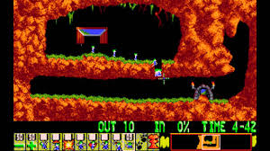
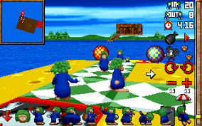
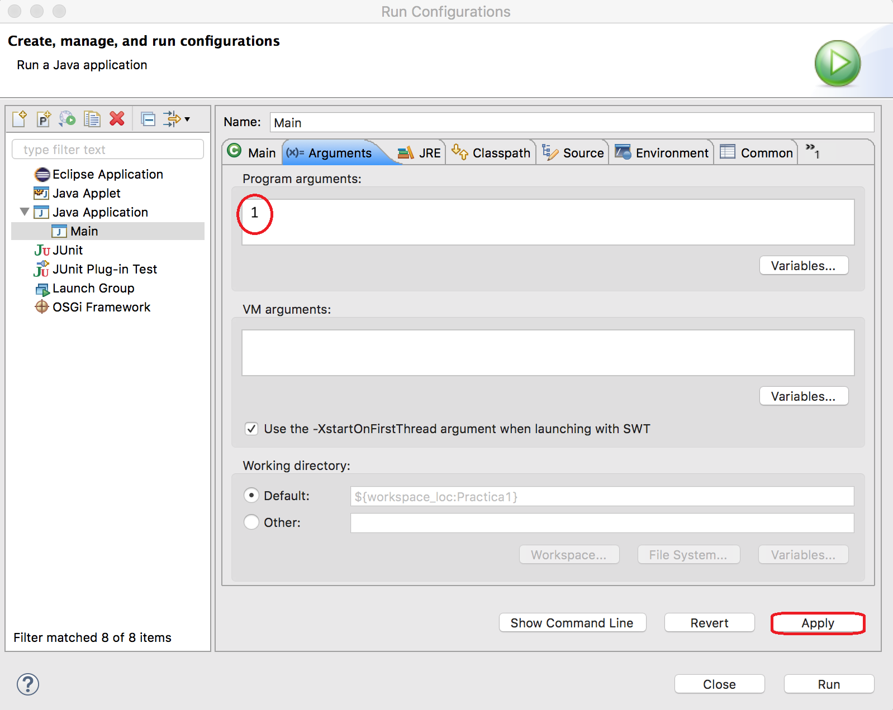
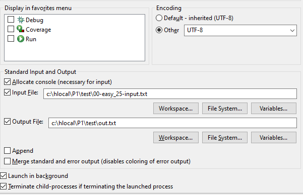
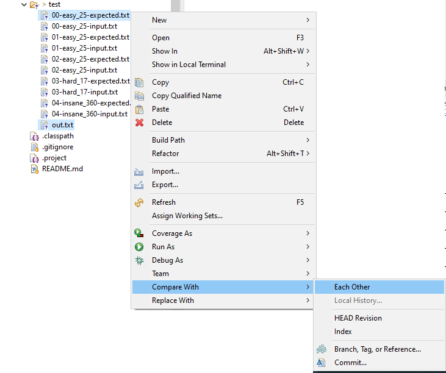

# Assignment 1: Lemmings

**Submission: 14 of october at 12:00**
 
**Objectives:** Introduction to object orientation and to Java; use of arrays and enumerations;
string handling with the `String` class; input-output on the console.

<!--
**FAQ**: Como es habitual (y normal) que tengáis dudas, las iremos recopilando en este [documento de preguntas frecuentes](../faq.md). Para saber los últimos cambios que se han introducido [puedes consultar la historia del documento](https://github.com/informaticaucm-TPI/2425-Lemmings/commits/main/enunciados/faq.md).
-->

<!-- TOC start -->
  * [Plagiarism](#control-de-copias)
- [1. Description of the assignment](#1-description)
  * [1.1 Introduction](#11-introduction)
  * [1.2. Details](#12-detalles-sobre-la-práctica)
  * [1.3. Game objects](#13-objetos-del-juego)
- [2. Organisation of the game](#2-organisation)
  * [2.1 Draw](#21-draw)
  * [2.2 User actions](#22-user-actions)
  * [2.3 Updates](#23-updates)
- [3. Implementation ](#3-implementation)
- [4. Submission](#4-submission)
- [5. Testing](#5-testing)
<!-- TOC end -->

<!-- TOC --><a name="control-de-copias"></a>
## Plagiarism

For each of the TP assigmments, all the submissions from all the different TP groups will be checked using anti-plagiarism software, firstly by comparing them all pairwise and secondly, by searching to see if any of their code is copied from other sources on the Internet. Any plagiarism detected will be reported to the *Comité de Actuación ante Copias* which, after interviewing the student or students in question, will decide whether further action is appropriate. This may include the opening of disciplinary proceedings with the relevant university authority (*Inspección de Servicios*).

<!-- TOC --><a name="1-description"></a>
# 1. Description of the assignment

<!-- TOC --><a name="11-introduction"></a>
## 1.1 Introduction

Lemmings is a classic game, released at the beginning of the 90s, which had a big influence on the development of puzzle-strategy videogames. The object of the game is to guide the lemmings, which move independently of the player, to a designated exit, avoiding a number of obstacles. The player can assign skills/roles to individual lemmings allowing them to alter their environment or their own behaviour in order to help the group of lemmings to reach the exit. There have been many different versions of the game since its first release.



Our aim is to develop a simplified version of the classic game, though we may later introduce some novel features. The first and most obvious simplification is that our version will not have a GUI and will instead use a text-based interface. The second main simplfication is that the original game evolves in real time, i.e. the lemmings move constantly, independently of any actions that the player may take. The simplified game we develop here, however, evolves in cycles in each of which the game stops for the player to choose an action he or she wishes to perform, after which the state of the game is updated, taking into account the chosen action.



If you do not know the game or have never played it, we recommend that you try it before carrying out the assignment. Several free versions can be found on the web, one of them being available at the following URL: https://www.1001juegos.com/juego/html5-lemmings.

During the term, we will progressively develop our own version of the game. In this first assignment, we develop a very reduced version in which the lemmings move independently of the player and can reach the exit if it exists. In the next assignment we will incorporate more functionality, in particular, introducing the different roles that the lemmings can be given. We will do so by using the tools of OOP, notably inheritance and polymorphism.

<!-- TOC --><a name="12-detalles-sobre-la-práctica"></a>
## 1.2. Details of the assignment

In this version of the game, the world in which the lemmings live consists of a **10 x 10** board of cells (i.e. 10 rows by 10 columns). Of course, the size of the board should be implemented using constants so that it can easily be changed if required. Internally, (0,0) are the coordinates of the uppermost, leftmost cell and (9,9) those of the lowermost, rightmost cell. However, in the interest of user-friendliness, in the display, the rows will be labelled using letters starting at `A` and the columns will be labelled using numbers starting at `1`. So for the player using a `10 x 10` board, the row-column of the uppermost, leftmost cell is identified as `A1` and that of the lowermost, rightmost cell as `J10`. Each cell may be occupied by one or more lemmings or by a wall/floor, the cells that are not so occupied being referred to as empty cells.

All the lemmings move in the same direction, initially from left to right. When they hit a wall (i.e. move onto a cell containing a wall) or a side of the board, they reverse their direction of movement. When they move onto a cell containing a precipice, they fall down it and only survive if the fall is not too big. If they arrive at the exit door, in the next cycle they leave the board and disappear from the game. Note that initially, lemmings can only leave the board via the bottom, the sides of the board acting like walls.

The player wins the game when there are no more lemmings on the board and at least the number of lemmings required by the level have left the board via the exit door. In this assignment, we only consider one type of lemming, the walking lemming.

In each cycle of the game, the following actions are carried out sequentially:

1. ***Draw.*** The current state of the game is displayed.

2. ***User command.*** The user is prompted for a command, and when the user enters a command it is read; some commands change the state of the game, while others do not.

3. ***Update***. The command is executed and, if the command requires, the game is updated by updating all the lemmings.

The implementation of the game cycle is termed the main loop of the game.

<!-- TOC --><a name="13-objetos-del-juego"></a>
## 1.3. Game objects

In this section, we describe the different objects that appear in the game and their behaviour

### Lemming

Lemmings move horizontally (from left to right or from right to left) or vertically downwards if they are in the air, that is, if there is no solid object in the cell below them. In the latter case, if a lemming falls 3 rows or more, when it hits the ground it dies, otherwise, on hitting the ground it carries on walking in the same direction. We model this by equating the "force" of the fall with the distance of the fall in terms of number of squares. On each cycle of the game, a lemming takes a single step.

Lemmings are considered game elements that are *not solid*, meaning that they can share a position with other non-solid elements, for example, other lemmings.

#### Wall/floor

A wall/floor is a passive element of the board, so nothing happens to them when the game is updated.

Walls/floors are solid elements, meaning that they cannot share a position with another solid object and that lemmings can be stand on them.

<!-- TOC --><a name="2-organisation"></a>
# 2. Organisation of the game

We now describe what occurs in each part of the main loop of the game.

<!-- TOC --><a name="21-draw"></a>
## 2.1 Draw

Displaying the current state of the game involves displaying the state of the board together with some other information, namely:

- the number of the current game cycle (initialised to 0),
- the number of lemmings left on the board,
- the number of lemmings that have died,
- and the number of lemmings that have already left the board followed by the minimum number of lemmings that must leave the board to win the game.

Each lemming on the board is represented on the display by the symbol **'B'**, if it is walking from left to right, and the symbol **'ᗺ'**, if it is walking from right to left (without inverted commas). Each wall is represented on the display by the symbol **'▓'** and the exit door is represented on the display by the symbol **'🚪'**. Below the board, the game prompt must be displayed to ask the user for the next action.

The board should be displayed on the console using simple text characters, as shown in the following example:

```
Lemmings 1.0

Cycle number: 0
Lemmings on board: 2
Dead lemmings: 0
Lemmings exit door: 0 ┃2

      1    2    3    4    5    6    7    8    9   10  
   ┌——————————————————————————————————————————————————┐
  A┃                                               B  ┃A
  B┃                                        ▓▓▓▓▓▓▓▓▓▓┃B
  C┃                                                  ┃C
  D┃            B    B                                ┃D
  E┃          ▓▓▓▓▓▓▓▓▓▓▓▓▓▓▓                         ┃E
  F┃                     🚪            ▓▓▓▓▓          ┃F
  G┃                    ▓▓▓▓▓▓▓▓▓▓▓▓▓▓▓▓▓▓▓▓          ┃G
  H┃                                                  ┃H
  I┃  B                                     ▓▓▓▓▓     ┃I
  J┃▓▓▓▓▓▓▓▓▓▓                              ▓▓▓▓▓▓▓▓▓▓┃J
   └——————————————————————————————————————————————————┘
      1    2    3    4    5    6    7    8    9   10  

Command > 
```

If you wish, you may use the colour layer (beta version) `ConsoleColorsView` to make the display more attractive. To do so, you only need to change `ConsoleView` for `ConsoleColorsView` in the corresponding line of the file `Main.java`.

<!-- TOC --><a name="22-user-actions"></a>
## 2.2 User actions

On each cycle, after displaying the board, the user is asked to choose one of the following commands:

- `help`: Displays information about the existing commands, each on a new line using the format: command name, followed by a colon, followed by a brief description of the command.

Este comando solicita a la aplicación que muestre la ayuda relativa a cómo utilizar los comandos. Se mostrará una línea por cada comando. Cada línea tiene el nombre del comando seguida por ':' y una breve descripción de lo que hace el comando. 

```
Command > help

Available commands:
[r]eset: start a new game
[h]elp: print this help message
[e]xit: end the execution of the game
[n]one | "": skip a cycle
```

- `reset`: Restarts the game in the initial configuration.

- `exit`: Exits the game after displaying the message *Player leaves game*.

- `none`: updates the game.

**Observations concerning the commands:**

- The player should be able to type a command in upper-case letters, lower-case letters or any mixture of the two.
- The player should be able to type the abbreviated version of the command (the character that appears in square brackets in the help message) in place of the whole command.
- The empty command, i.e. simply pressing *return*, should have the same effect as the `none` command.
- If the command does not exist (perhaps due to being badly written) or cannot be executed in the current state, a suitable error message must be displayed.
- After the execution of a command that doesn't change the state of the game, e.g. `help`, or after an error,
  the board must not be displayed.

<!-- TOC --><a name="23-updates"></a>
## 2.3 Update

Each lemming is updated on each cycle, giving rise to its movement (and later, other possible actions).
The game finishes when there are no lemmings left on the board or when the the `exit` command is executed.
In the former case, one of the messages **'Player loses'** or **'Player wins'**
must be displayed in function of whether a sufficient number of lemmings have left the board.
You will find the required constants of type `String` already defined in the `Messages.java` class.

# Application parameters

In this first version of the game, boards will be stored in an ***ad-hoc*** manner via dedicated methods `initGameO()`, `initGame1()`,... , one for each level, that place lemmings and walls in different positions.

The program must accept an optional command-line parameter called **level**. In the example shown in the image, the level being loaded is level `1`, which is the level loaded by default if no command-line argument is provided. The `initGameO()` is the same but without the lemming in position `D3`. You may create other levels to implement tests, such as a test in which the player wins, a test in which some lemming remains blocked and the game doesn't terminate, etc. In future assignments, we will provide different worlds.



<!-- TOC --><a name="3-implementation"></a>
# 3. Implementation

We start this section by observing that the quality of the implementation proposed here is not optimal,
one of the reasons for this being that it does not adhere to the **DRY (Don't Repeat Yourself)**
programming principle. The duplication of
code in different parts of a program makes it less maintainable, less readable and less
testable; modifying such a program is considerably more complicated and error-prone.
In the second assignment, we will *refactorise* the code, improving it by
introducing **inheritance** and **polymorphism**, two basic tools of
object-oriented programming (OOP), thereby converting it into a genuine
object-oriented program and facilitating conformity with the DRY principle.

The application is launched by executing the `tp1.Main` class so that you are advised to place all the classes you develop in the package `tp1` or subpackages of this package.

### Game objects

To represent one of the types of element that can appear on the board, referred to as game objects, you will need at least the following classes:

- `Lemming`: objects of this class represent individual lemmings. The class has at least the following attributes: position on the board, a boolean attribute indicating if it is alive or not, an attribute storing its direction of movement, an attribute storing the force of a fall, as well as two attributes explained below: one called `role` of type `WalkerRole`, representing the current role of the lemming, and one called `game` of type `Game` (this class is presented below).

  The attribute of type `WalkerRole` represents the role of the lemming at that moment. The `Lemming` class will delegate many of its tasks to this attribute, enabling its behaviour and how it is displayed to be easily changed at run-time, simply by changing its value. However, in this assignment, the lemmings do not change role and the only role to be implemented is that of ***basic walker***.

  The attribute of type `Game` enables the lemming to interact with its environment, for example, to know that the position that it intends to move to is occupied. The disadvantage of using such an attribute for this purpose is that lemmings have access to all the public methods of the `Game` class, not only those which serve for them to interact with their environment, thereby reducing the clarity of the code and increasing the propensity for programmer errors. This difficulty will be resolved in assignment 2 via the use of ***interfaces***.

- `Wall`: objects of this class represent a wall (to lemmings on the same row) or the floor (to lemmings on the row above) and in the first assignment have little or no functionality. The class has an attribute for its position on the board. Since walls do not interact with their environment, the class does not need an attribute of type `Game`.

- `ExitDoor`: objects of this class represent an exit door. The class has an attribute for its position on the board. Since exit doors do not interact with their environment, the class does not need an attribute of type `Game`. If a lemming is positioned on an exit door (i.e. shares a cell with an exit door), on being updated, it will pass through the door and disappear from the board and will be considered to have successfully exited the world. 

### The `WalkerRole` class

As indicated earlier, this class is responsible for executing the role-specific behaviour of the lemming and for returning its visual representation (its icon). In the first assignment, there is only one role so this class corresponds to the ***basic walker*** role.

<!--
SIMON: I have left this phrase without being translated until I have checked the solution. It would seem to be saying that the WalkerRole class has an attribute of type Lemming (as well as the Lemming class having an attribute of type WalkerRole)? If so, this strikes me as wierd and will lead to the creation of an unnecessarily large number of role objects. Is this a way of implementing an inner class without using inner classes? Wouldn't it be better for the lemming to pass 'this' to the 'play' method of the role? Now implemented by passing this and then using a callback.
"Para realizar dichas tareas tendrá como atributo el lemming sobre el que se aplica el role y con el que interaccionará para implementar el role."
-->

The `WalkerRole` class needs the following methods:

```java
    public void advance(Lemming lemmy) {...}

    @Override
    public String getIcon() {...}
```
<!-- <span style="color:red">**AE**: Al nombre sigo dandole vueltas: ¿execute?,¿playOneTurn?, ¿play?.</span> -->

Since, by default, the lemming is a basic walker, the `advance` method only needs to call the basic `move` method of the lemming that called it (i.e. the one passed to it as a parameter) [^1].

[^1]: How does the invoking lemming object pass itself as a parameter to the `advance` method? By using `this`.

### Updating the game objects

All game objects implement the method:

```java
    public void update() {...}
```
which updates the object in function of its current state and that of the rest of the game. Updating an object may not only change its state but also that of its environment via the attribute `game` (this will occur in the second assignment).

The update of a wall/floor does nothing (the method has an empty body). The update of a lemming must perform the following tasks:

- Check if the lemming is alive 
- Delegate to the `WalkerRole` by calling the `advance` method which will call the `move` method of the lemming, which will then carry out the following tasks:
    - If falling, manage the fall; in particular, die if a floor has been reached after a fall that is too big.
    - If in the air but not falling, fall.
    - If neither falling nor in the air, move normally. A normal move is either advancing one cell or changing direction.

For a lemming to know whether it is falling or dying after a fall, is also done by delegation, since in later versions being in the air does not necessarily imply falling (escalator) and falling too far does not necessarily imply dying (parachute).

<!--
#### Eliminación de objetos del juego

Los objetos de juego incluirán un método

```java
    public void onDelete() {...}
```

que será invocado **desde el contenedor de objetos** cuando se detecte que el objeto ha muerto, justo antes de que el objeto sea eliminado definitivamente de su contenedor (ver más abajo). 

Dicho método se encargará de realizar aquellas acciones necesarias en el momento de la eliminación del objeto. Por ejemplo, los lemmings notificarán al juego que han muerto para que éste lleve la cuenta del número de lemmings vivos.
-->
### The 'model' part of the application: the container

There is only one exit door on the board but there may be multiple lemmings and multiple walls/floors. For this reason, we need classes that represent *containers* of these game objects. One possibility is to use a class called `GameObjectContainer` which contains the exit door, a list of lemmings and a list of walls. Each list will be implemented as a basic Java array of the relevant type together with a counter). There will only be one instance of the `GameObjectContainer` in the application which we will refer to as the `container`.

The `GameObjectContainer` class will also have methods to manage the methods and the walls, in particular, the following methods:

```java
    public void add(Lemming lemming) {...}
    public void add(Wall wall) {...}
```

and

```java
    public void add(ExitDoor exitDoor) {...}
```

Observe that these methods are overloaded, that is, they have the same name but different parameter types; the compiler can distinguish them by the parameter types.

The container is also responsible for channeling the invocations made by the game to each of the game objects on the lists of objects that it manages.

###  The 'model' part of the application: the game

The `Game` class encapsulates the logic of the game and contains an attribute whose value is an instance of the `GameObjectContainer` class. There will only be one instance of the `Game` class in the application which we will refer to as the `game` (we will also use `game` as the name of the attribute of any class that contains a reference to this object). The `Game` class also contains several counters: the cycle counter, the counter of the number of lemmings on the board,...

The `Game` class contains a method `update` which updates the state of all the elements of the game, where this basically consists of incrementing the cycle number and invoking the `update` method of the `container` which, in turn, invokes the update method of each of the game objects.

### The 'control' and 'view' parts of the application

- `Controller`: this class controls the execution of the game and coordinates the view and the model parts of the application. It is responsible for prompting the user for a command using the view method `getPrompt` and for invoking methods of `game` according to the command that the user enters. The controller class needs, at least, two attributes containing the `game` and an instance of the `GameView` class. There will only be one instance of the `Controller` class in the application which we will refer to as the `controller`.

  The controller class implements a public method `public void run()` which contains the main loop of the program. Concretly, while the game is not finished, it requests orders from the user, executes them and, if the state of the game has changed, calls a method of the view to display the updated state. 

- `GameView`: has an attribute containing the game and a method `showGame` that displays the current state of the game as described above. It also contains other methods invoked to display different types of messaages.  In the first assignment, there will only be one instance of the `GameView` which we will refer to as the `view`.

### Other classes

- `Direction`: an enumeration that represents the different movements that game objects can make.

- `Position`: an **immutable** class that represents a position on the board; it has attributes `row` and `column`.

- `Main`: this class contains the `main` method of the application, which creates the `game`,  the `view` and the `controller`, passing the first as an argument to the constructor of the second and third, and then invokes the `controller` run method

### Observations concerning the implementation

We provide a template containing part or all of the code for some of the classes you are to use.

The rest of the information needed to implement the assignment will
be provided by the lecturer during the lectures and lab classes.
The lecturer will give indications of which aspects of the
implementation are considered obligatory in order to accept the
assignment as correct and which aspects are left to the students'
judgement.

Note also that in a *Problem-Based Learning* approach, with the lecturer's guidance, the student is required to
search for the knowledge they need to solve the problem at hand and to apply this knowledge
to solving the problem *before* the pertinent information and solutions is presented
in lectures. Many studies have shown that knowledge is more easily absorbed and retained if it is acquired in this way, by the
student working under the lecturer's guidance but independently. Moreover, perhaps the most
important ability to be acquired at university is how to learn independently.

<!-- TOC --><a name="4-submission"></a>
# 4. Submission

The assignment must be submitted as a single compressed (with `zip`) archive via the
Campus Virtual submission mechanism not later than the date and time indicated at the start of this
document [^2].
The zip archive should contain at least the following [^3].

- A directory called `src` containing the Java source code of your solution,
- a file called `students.txt`, containing the names of the members of your group.

**Do not include the files generated on compilation**, i.e. the `.class` files,
which, if you created your project following the procedure indicated in Assignment 0, should
be in a separate directory called `bin`.

It is good practice to also include:

- a directory called `doc` containing the API documentation in HTML format generated
  automatically from the Java source code of your solution using the *javadoc* tool.

However, it is not obligatory and the contents of any `doc` directory you may include will **not**
contribute to your grade for the assignment. Note that using *javadoc* involves adding comments to your
code in the *javadoc* format otherwise the HTML that you generate will contain almost no information.

[^2]: To generate the `zip` file, you may find it helpful to use the Eclipse option *File > Export*.
[^3]: You may also include the project information files generated by Eclipse.

<!-- TOC --><a name="5-testing"></a>
# 5. Testing

Together with the instructions for the assignment, you have a directory of program traces.
In the directory there are files following one of two nomenclatures:

- `00_1-play_input.txt`: the test case with input `1` on map `00` whose purpose is to test the `play` command.
- `00_1-play_expected.txt`: the expected output for the previous test case
- `01_1-command_input.txt`: the test case with input `1` on map `01` whose purpose is to test the commands.
- `01_1-command_expected.txt`: the expected output for the previous test case

To take the input of a Java program from a given input text file and send the output to an output text file in Eclipse,
you can configure the *redirection* of the standard input and standard output / standard error
in the `Common` tab of the `Run Configurations` window as shown in the following figure. The easiest
thing to do is to create at least one `Run Configuration` for each test case.



There are many free programs to visually compare files and thereby check that the output of your
program coincides with the expected output for each of the test cases we provide. In particular,
there is one integrated in Eclipse: select the files you wish to compare, press the right button
and then select `Compare With > Each other` in the pop-up menu, as shown in the following figure:



Another window will appear showing clearly the differences between the two text files. Two other possibilities are [Beyond compare](https://www.scootersoftware.com/) and [DiffMerge](https://sourcegear.com/diffmerge/).

If you detect an error in the output of any of the test cases provided please let the lecturer know ASAP so that we can correct it.

You should also create and execute your own test cases to check the correctness of other executions of your implementation, as we will do during the correction of the assignments.

