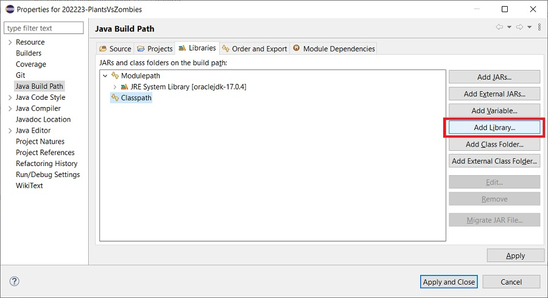
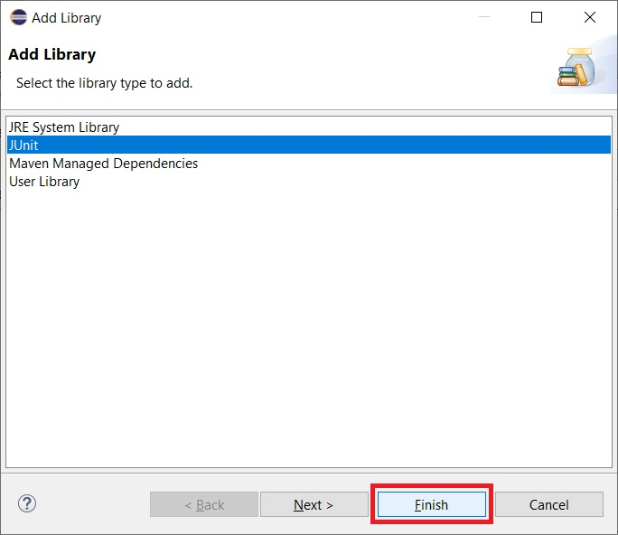
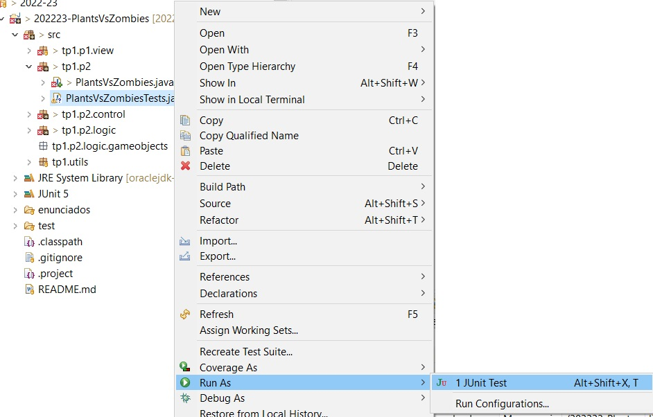
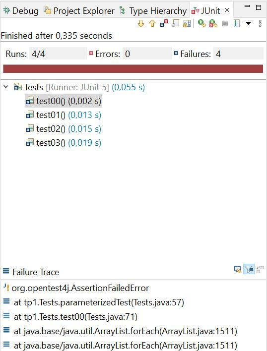
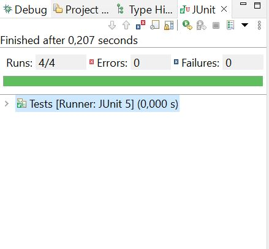

<!-- TOC start -->
- [Práctica 2 - Parte I: Lemmings Refactored](#práctica-2---parte-i-lemmings-refactored)
	- [Introduction](#introducción)
	- [Refactoring the solution of the previous assignment](#refactorización-de-la-solución-de-la-práctica-anterior)
		- [The *Command* pattern](#patrón-command)
		- [Inheritance and polymorphism](#herencia-y-polimorfismo)
		- [The Game object container](#contenedor-de-objetos-del-juego)
		- [Interfaces implemented by the `Game` class](#interfaces-de-game)
	- [Testing](#pruebas)
<!-- TOC end -->
<!-- TOC --><a name="práctica-2-parte-i-lemmings-refactored"></a>
# Assignment 2 - Part I: Lemmings Refactored
 
**Objetivos:** Inheritance, polymorphism, abstract classes and interfaces.

<!--
**Preguntas frecuentes**: Como es habitual (y normal), que tengáis dudas, las iremos recopilando en este [documento de preguntas frecuentes](../faq.md). Para saber los últimos cambios que se han introducido [puedes consultar la historia del documento](https://github.com/informaticaucm-TPI/2324-SpaceInvaders-SOLUCION/commits/main/enunciados/faq.md).
-->

<!-- TOC --><a name="introducción"></a>
## Introduction

In this assignment, we apply the mechanisms that OOP offers to improve and extend
the code developed in the previous assignment as follows:

- In Part I of this assignment, we refactor[^1] the code of the previous assignment in the following two ways:

  - First, by removing some code from the controller `run` method and distributing
    its functionality among a set of well-structured classes. This involves applying what
    is known as the *command pattern*.

  - Second, by defining an inheritance hierarchies, the leaves of which will be the classes that
    were used in the previous assignment such as `Lemming`, `Wall`, `ExitDoor` or such as `WalkerRole`.
    The use of inheritance enables us to avoid having identical, or nearly identical, code
    in different classes. It also enables us to reorganise how we store the information
    about the state of the game, using a single data structure instead of two different lists.

  The aim of these changes is to produce code that is more extensible, adaptable, maintainable,
  robust, etc. without changing the functionality. Note that if the functionality has not changed, the
  refactored code should pass the same tests as the code submitted for Assignment 1.

- Once the code has been refactored, in part II of this assignment, we add new commands and new elements to the game,
  thereby demonstrating how the new structure facilitates these extensions.

So the objective of the first part of Assignment 2 is to make the code more extensible, adaptable, maintainable,
robust, etc. without changing its functionality.

[^1]: Refactoring means changing the structure of code (to improve it, presumably) without changing its functionality.

<!-- TOC --><a name="refactorización-de-la-solución-de-la-práctica-anterior"></a>
## Refactoring the solution to the previous assignment

<!-- TOC --><a name="patrón-command"></a>
### The *command pattern*

In the application built in the previous assignment, the user could enter several different commands in order to update the game,
reset the game, ask for help, etc. The objective of the first part of the refactoring is to introduce
a structure to the part of the code that is concerned with processing the user commands which
will facilitate the addition of new commands, i.e. which will enable new commands to be added
with minimal modifications to the existing code. This structure is the well-known software
design pattern [^2] referred to as the *command pattern* [^3]. The general idea is to encapsulate each user
action in its own class where, in this case, the user actions are the commands.

[^2]: You will study software design patterns in general, and this software
design pattern in particular, in the Software Engineering course.

[^3]: Strictly speaking, we use a slightly-modified version of the *command pattern*,
adapted to the needs of this assignment.

The following classes are involved in our application of the *command pattern*:

- `Commmand`: an abstract class that encapsulates the functionality that is common to all the concrete commands.
    It has four attributes of type `String`, initialised in the constructor: `name`, `shortcut`, `details`, `help`,
    and *getter* methods for each of these attributes.

- `NoParamsCommand`: an abstract class that inherits from `Commmand` and which is the base class of any command
   class representing a command with no parameters, the case for all of the commands we have defined so far.

- Concrete command classes: `HelpCommand`, `ExitCommand`, etc., one class for each program command.
  In the case of a command with parameters, the corresponding class will have attributes to store the value
  of these parameters. Each concrete command class has (at least) the following three methods:

  - `protected boolean matchCommand(String)`: checks if the first word of the text introduced by the user
     via the keyboard (minimally processed) corresponds to the command name. It is called by the parse method.

  - `public Command parse(String[])`: checks if the text introduced by the user via the keyboard
     (minimally processed) corresponds to a use of the command (which involves checking the validity
     of the parameter values):

     * If so, it returns an instance of the owning class, which then represents this use of the command.
       In the case of a command with no parameters, the `parse` method can simply return the value `this`.
       but in the case of a command with parameters, to avoid creating *fragile* code [^4], it must return
       a new instance of the command class, rather than changing the values of the attributes
       of the containing object and then returning `this`.

     * If not, it returns the value `null`.
  
  - `public void execute(Game, GameView)`: executes the functionality associated to the command by calling
    a method of the `Game` class, updating the view where necessary (in some commands, this method may also
    perform some other actions). In later versions of the program, command execution may fail, in which case
    updating the view will consist of printing an error message instead of printing the current state of the
    game.

- `Controller`: the code of the controller class is now reduced to only a few lines since most of the
  functionality that it included in Assignment 1 is now delegated to the concrete command classes.

[^4]: Fragile code is code which makes implicit assumptions about its
environment (where this refers to the rest of the program code together with the program environment)
which can lead to it working incorrectly if its environment changes and no longer fulfills these assumptions.
In the case in point, returning the value `this` is making the implicit assumption
that there will only ever be one instance of the corresponding command class in the program at the same time
(the one that is in the `AVAILABLE_COMMANDS` list). Command objects that represent commands without parameters
are *stateless* since, in the absence of attributes, an instance is simply a pointer to a set of methods;
for such objects the above-mentioned assumption is in no way restrictive. However, command objects that
represent commands with parameters are *stateful* and
though the above assumption holds for such commands in the current program, it may not hold for them in evolutions
of the program, e.g. a program where we store a stack of command objects in order to implement an *undo* command,
so why make it, given that it is completely unnecessary to do so?

**Main loop of the program**. In the previous assignment, in order to know which command to execute, the main loop of the program
in the `run` method of the controller contained a switch or if-else ladder with one option for each of
the commands. In the reduced version of the controller, the `run` method has the
following aspect (your code does not have be be exactly the same but should be similar):

```java
while (!game.isFinished()) {

    String[] userWords = view.prompt();
    Command command = CommandGenerator.parse(userWords);

    if (command != null) 
        command.execute(game, view);
    else 
        view.showError(Messages.UNKNOWN_COMMAND);
}   
```

Basically, while the game is not finished (due to internal game reasons or to a user exit), the
program reads the text entered by the user, parses it to obtain an object of class `Command`
and then calls the `execute` method of this object to effect the functionality of the command
entered by the user and to update the view after doing so, if necessary. In the case where the
input text does not correspond to any of the existing commands, the error message
`Messages.UNKNOWN_COMMAND` is printed.

**Genericity of the `Controller` class**. The most important part of the code for the
main loop shown above is the following line:

```java
Command command = CommandGenerator.parse(userWords);
```
The key point is that the controller is generic: it only handles abstract commands and does not know
which concrete command is being executed; the knowledge of what functionality corresponds to each
command is contained in each concrete command class. It is this mechanism that facilitates the
addition of new concrete commands with minimal changes to the existing code. 

**The `CommandGenerator` class**. The `parse` method of this class is a static method
which returns an instance of the concrete command class that corresponds to the text entered by the user.
To this end, the `CommandGenerator` class has a static attribute containing a list
of instances of the class `Command`, concretely, it contains exactly one instance of each of
the existing command classes. The `parse` method of the `CommandGenerator` method traverses
this list calling the `parse` method of each of its command class instances.
If any of these `parse` methods returns a non-null value (which will be an instance of one
of the command classes), the `parse` of the `CommandGenerator` returns this non-null value,
otherwise it returns the value `null`.

The `CommandGenerator` contains another static method `commandHelp` that generates
the output of the help command (so must be called by the `execute` method of the `HelpCommand`
class). Like the `parse` command, it accomplishes its task by traversing the `AVAILABLE_COMMANDS`
list but in this case invoking the `helpText()` method of each object in the list.

The following is a skeleton of this code:

```java
public class CommandGenerator {

    private static final List<Command> AVAILABLE_COMMANDS = Arrays.asList(
        new UpdateCommand(),
        new ResetCommand(),
        new HelpCommand(),
        new ExitCommand(),
        // ...
    );

    public static Command parse(String[] commandWords){
	//...
    }

    public static String commandHelp(){
	//...
    }

}
```

**The concrete command classes** As already stated, each command has four attributes of type `String`:
its name, its abbreviated name (or shortcut), the initial part of its help message, and the details of its help message.
For example, the concrete command `HelpCommand` has the following constants and its constructor passes
their values to the constructor of its superclass as follows:

```java
public class HelpCommand extends NoParamsCommand {

	private static final String NAME = Messages.COMMAND_HELP_NAME;
	private static final String SHORTCUT = Messages.COMMAND_HELP_SHORTCUT;
	private static final String DETAILS = Messages.COMMAND_HELP_DETAILS;
	private static final String HELP = Messages.COMMAND_HELP_HELP;

	public HelpCommand(){
		super(NAME, SHORTCUT, DETAILS, HELP);
	}

    // Implementation of execute
}
```

**The `NoParamsCommand` class** which inherits from `Command` is the superclass of all concrete command
classes that represent commands with no parameters such as `HelpCommand`. The *raison d'être* of this class
is that the parsing of all commands with no parameters only differs in the value of the `name` and `shortcut`
attributes used to compare with the input text, so that the `parse` method of all these classes can be
inherited from the `NoParamsCommand` class. Evidently, the same is not true of the `execute` method which
will be different for every command, for which reason, the `NoParamsCommand` class must be abstract.

<!-- TOC --><a name="herencia-y-polimorfismo"></a>
### Inheritance and polymorphism

We have seen that the use of inheritance in the `Command` inheritance hierarchy significantly reduces the
repetition of code. Moreover, the use of
inheritance and polymorphism in the *command pattern* greatly facilitates the introduction of new commands,
the key aspect being that the `Controller` class is generic, i.e. it does not handle specific commands
but only handles objects of the abstract class `Command`.

Similarly, use of inheritance in an inheritance hierarchy of game objects would also reduce the repetition
of code and facilitate the introduction of new game objects. The key aspect to obtaining the latter benefit
is that the `Game` class
be generic, i.e. it should not handle specific game objects only objects of an abstract class
called `GameObject`, from which all the concrete game object classes
(currently `Lemming`, `Wall` and `ExitDoor`), derive. So *the game code must **not** seek to identify the 
dynamic type (i.e. which concrete subclass of `GameObject`) of the objects it is handling*.
This abstract class should contain
all the attributes and methods that are common to all the concrete game object classes; where appropriate,
each concrete game object class can overwrite inherited methods to implement its own behaviour. Note that

- whether to define an abstract method in `GameObject`, or a method containing default behaviour, is
  a design decision,
  
- in accord with the DRY principle, attributes and non-abstract methods should always be placed in the
  highest class possible of the inheritance hierarchy.

All game objects have, at least, an attribute to store the game, an attribute to store their position and a
boolean attribute to indicate whether they are alive or not. They have, at least, methods to manipulate their
position and a method to communicate whether they are alive or not. They will also have the method:

```public void update()```

which, in the case of the `Wall` class, has an empty body.

<!-- TOC --><a name="contenedor-de-objetos-del-juego"></a>
### The game object container

Having refactored the code for the commands and for the game objects, we now turn our attention to the
management of the game objects. As in the previous assignment, the game objects will be managed by the
`GameObjectContainer` class. However, instead of using multiple lists, we can take advantage of the
inheritance hierarchy of game objects to store them all on a single list of objects of type `GameObject`.
For simplicity, we use an `ArrayList` [^5] of elements of type `GameObject`:

```java
public class GameObjectContainer {

	private List<GameObject> gameObjects;

	public GameObjectContainer() {
		gameObjects = new ArrayList<>();
	}
    //...
}
```
[^5]: `ArrayList` is a class defined in the Java collections library. The classes of this library
make use of *parametric polymorphism*, known as *Java generics* in Java, first
used in functional programming in the mid-70s and introduced in Java in 2004 (with Java 5).
The polymorphism associated with inheritance is called *inclusion polymorphism* or *subtype polymorphism*.
Java generics will be studied in detail in the TP2 course.

Observe that, like the `Game` class, the `GameObjectContainer` class only deals with objects of the abstract
class `GameObject` so, like the game code, *the container code must **not** seek to identify the dynamic type
(i.e. which concrete subclass of `GameObject`) of the objects it is handling*. Finally, it is of great importance that
the implementation details of the `GameObjectContainer` be private so, for example, it should not export the
value of any of the attributes of the `ArrayList` class that it is using to store the game objects.
This information hiding enables the implementation of the container to be changed without affecting the
rest of the program code.

<!-- TOC --><a name="interfaces-de-game"></a>
### Interfaces implemented by the `Game` class

The `Game` class offers services to different parts of the program, namely:

- *Controller*: invokes those methods of the game, such as `update` or `reset`, that implement the commands entered by the user; after the above-described refactoring, the calls to these methods are made from the body of the `execute` methods of the `Command` classes. It also invokes methods that return information about the state of the game, such as `isFinished`.

- *View*: invokes methods that return information about the state of the game, such as `getCycle`, `numLemmingsInBoard` or `positionToString`, that is needed to display the current state.

- *Model*: the game objects (part of the model, as is the `Game` class itself) invoke those methods of the game, such as `isInAir` or `lemmingArrived`, that concern interactions between game objects. Since these calls *to* the game result from calls *by* the game via the container, usually as part of an update, they are referred to as *callbacks*.

Notice that with the current implementation, nothing prevents the *model* invoking a method of `Game` that was designed for the *controller* to invoke, e.g. a game object invoking the `reset` method, or the *view* invoking a method of `Game` designed for the *model* to invoke, e.g. the game view invoking the `lemmingArrived` method, etc. In order for the compiler to detect such inconsistent invocations we can use interfaces to define *partial views* on the services offered by the `Game` class. To that end, we define the following three interfaces:

- `GameModel` to represent the *controller*'s view of the services offered by the `Game` class,

- `GameStatus` to represent the *view*'s view of the services offered by the `Game` class,

- `GameWorld` to represent the *model*'s view of the services offered by the `Game` class.

For example:


```java
public interface GameModel {

	public boolean isFinished();
	public void update();
	public void reset();
	// ...
}
```

The `Game` class must then implement these interfaces:

```java
public class Game implements GameModel, GameStatus, GameWorld {

	// ... 
	private GameObjectContainer container;
	private int nLevel;
	// ...
	
	// Methods declared in GameModel
	// ...
	// Methods declared in GameWorld
	// ...
	// Methods declared in GameStatus
	// ...
	// Other methods
	// ...
}
```

Finally, in each part of the three parts of the program, we must replace each occurrence of the type `Game` by the corresponding interface type. For example, the execute method of the `Command` class now has the following form:

```java
public abstract void execute(GameModel game, GameView view);
```

<!-- TOC --><a name="pruebas"></a>
## Testing

Recall that after refactoring, the program should have exactly the same functionality as the versión previous to the refactoring and should therefore pass the same system tests, even though the implementation now contains many more classes.

To simplify the tests, we are going to "abuse" the Eclipse [JUnit](https://junit.org/) support, in order to facilitate the comparison of the actual program output with the expected output. JUnit is a testing framework [^6] for automating the testing of Java code, which you will undoubtedly come across in other courses of your degree (or one of the many derived frameworks).

[^6]: Originally, a unit-testing framework, hence the name. The first version, written in 1997 was based on SUnit, a unit-testing framework for Smalltalk, which preceeded it by almost a decade.

The template that we provide you with includes a class called `tp1.Tests` containing the JUnit tests, concretely, one test case for each of those of Assignment 1. In order to execute these test cases, you must first add the JUnit library to the project. To do so, select *Project > Properties*, then *Java Build Path*, then the *Libraries* tab. Then, with *Classpath* selected (not *ModulePath*), click on *Add Library...*.



In the pop-up window select *JUnit* then click on the *Finish* button.



On returing to the project properties window, click on the *Apply and Close* button.

If the configuration has been done correctly, on clicking with the right mouse button on `Tests.java`, the *Run As* menu should include the option *JUnit Test*.



On executing the tests in Eclipse, the the results are displayed in a view that also enables the tests to be rerun, either individually or all at once. Note that the JUnit test verdict is a simple yes or no according to whether or not the program output is identical to the expected output. In the case where it is not, to see the differences between them, the two files will need to be compared in the same way as in Assignment 1.

<!--  -->
<figure>
    
    <figcaption>Fallan las pruebas JUnit</figcaption>
</figure>

<!--  -->
<figure>
    
    <figcaption>Todas las pruebas JUnit tienen éxito</figcaption>
</figure>
